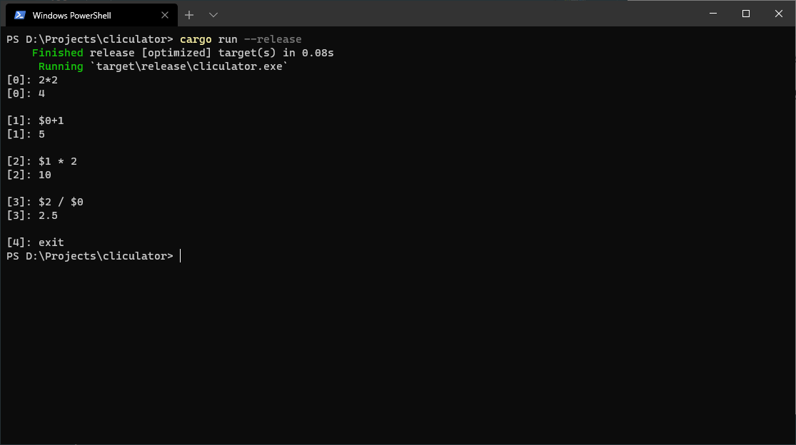

# Cliculator

A CLI calculator with history referencing. This is a personal project for learning rust.

## How to use
Right now cliculator only has `+`, `-`, `*`, `/`, `$` operators, these will increase as time goes on.

### History Referencing
Use the `$` operator to reference a previous calculation like `$0` to reference the first calculation's answer.

## Known Issues
- Calculations involving decimal values only work with other decimal values, i.e. temporarily use `1.2 / 4.0` instead of `1.2 / 4`.